```mermaid
graph TD
    A[KeepaliveManager] --> B[useKeepalive Hook]
    B --> C[KeepaliveService]
    C --> D{Web Worker?}
    D -->|Sí| E[keepalive-worker.js]
    D -->|No| F[setInterval fallback]
    E --> G[HEARTBEAT_REQUEST cada 30s]
    F --> H[sendHeartbeat cada 30s]
    G --> I[handleWorkerHeartbeatRequest]
    H --> I
    I --> J[Firebase setDoc]
    J --> K[events/event_X/teams_keepalive/team_Y]
    
    L[Firebase onSnapshot] --> M[subscribeToTeams]
    M --> N[Actualiza Redux teams]
    N --> O[Re-render componentes]
```

# Análisis de Sistemas: Keepalive y Chat

## Resumen Ejecutivo

Este documento identifica y acota los dos subsistemas principales que causan problemas de rendimiento en la aplicación:

1. **Sistema de Keepalive**: Actualización de estado de conexión cada 30 segundos
2. **Sistema de Chat**: Múltiples suscripciones en tiempo real a Firebase

---

## 🔴 SISTEMA 1: KEEPALIVE

### Componentes del Sistema

#### A. **Componentes React**
```
src/components/KeepaliveManager.jsx
```
- **Función**: Gestiona automáticamente el keepalive basado en evento y equipo
- **Frecuencia de actualización**: Depende del hook `useKeepalive`
- **Dependencias Redux**: `state.event.data`, `state.session`

#### B. **Hooks**
```
src/hooks/useKeepalive.js
```
- **Función**: Hook personalizado para gestionar keepalive
- **Configuración por defecto**:
  - `heartbeatInterval: 30000` (30 segundos)
  - `maxReconnectAttempts: 5`
- **Acciones Redux disparadas**: Múltiples actualizaciones de estado cada 30s

#### C. **Servicios**
```
src/services/keepalive.js (Clase KeepaliveService)
src/services/firebase.js (funciones: initializeKeepalive, cleanupKeepalive)
```
- **Función**: Servicio central que gestiona la comunicación con Firebase
- **Características**:
  - Web Worker para operaciones en segundo plano (`public/keepalive-worker.js`)
  - Fallback a `setInterval` si Web Workers no disponible
  - Listener de Firebase: `onSnapshot` en colección `teams_keepalive`

#### D. **Redux Slice**
```
src/features/keepalive/keepaliveSlice.js
```
- **Estado gestionado**:
  - `isOnline`, `lastHeartbeat`, `heartbeatCount`
  - `connectionStatus`: 'connecting' | 'connected' | 'disconnected' | 'error'
  - `teams`: Estado de otros equipos conectados
  - `appState`, `currentActivity`, `appStateTimestamp`

#### E. **Web Worker**
```
public/keepalive-worker.js
```
- **Función**: Ejecuta heartbeats en segundo plano
- **Intervalo**: Configurable, por defecto 30000ms
- **Comunicación**: 
  - `HEARTBEAT_REQUEST` → hilo principal
  - `HEARTBEAT_RESPONSE` ← hilo principal

---

### Flujo de Comunicación con Firebase



### Puntos de Escritura a Firebase

1. **Registro inicial**: `registerTeam()`
   - Ruta: `events/event_{id}/teams_keepalive/team_{id}`
   - Frecuencia: Una vez al inicializar

2. **Heartbeats periódicos**: `sendHeartbeat()` / `handleWorkerHeartbeatRequest()`
   - Ruta: `events/event_{id}/teams_keepalive/team_{id}`
   - Frecuencia: **Cada 30 segundos**
   - Operación: `setDoc(..., { merge: true })`
   - Datos enviados:
     ```javascript
     {
       lastSeen: serverTimestamp(),
       status: 'online',
       timestamp: Date.now(),
       appState: keepaliveState.appState,
       currentActivity: keepaliveState.currentActivity,
       appStateTimestamp: keepaliveState.appStateTimestamp
     }
     ```

3. **Obtención hora servidor**: `getServerTime()`
   - Ruta: `events/event_{id}/server_time/now` o `server_time/now`
   - Frecuencia: Variable (en callbacks de Firebase)
   - Operación: Escritura + lectura inmediata

### Puntos de Lectura desde Firebase

1. **Suscripción a equipos**: `subscribeToTeams()`
   - Ruta: `events/event_{id}/teams_keepalive`
   - Tipo: `onSnapshot` (tiempo real)
   - Query: `orderBy('lastSeen', 'desc').limit(50)`
   - Frecuencia: **CONTINUA** (escucha cambios en tiempo real)
   - Procesamiento:
     ```javascript
     snapshot.docChanges().forEach((change) => {
       // Por CADA cambio en CUALQUIER equipo
       // Se dispara actualización en Redux
       dispatch(updateTeamStatus(...))
     })
     ```

### Problemas de Rendimiento Identificados

#### 🔴 CRÍTICO 1: Actualizaciones Redux masivas
- **Problema**: Cada heartbeat (cada 30s) actualiza Redux
- **Impacto**: Re-renderizado de componentes que dependen de `state.keepalive`
- **Componentes afectados**:
  - `KeepaliveManager.jsx`
  - `eventMap.jsx` (usa `keepaliveTick`)
  - Cualquier componente que use `useSelector(state => state.keepalive)`

#### 🔴 CRÍTICO 2: Listener Firebase muy activo
- **Problema**: `onSnapshot` dispara callback por CADA cambio en CUALQUIER equipo
- **Impacto**: Con N equipos, N actualizaciones cada 30s
- **Ejemplo**: 10 equipos = 10 callbacks de Firebase cada 30s = ~20 actualizaciones/minuto

#### 🟡 MEDIO: Escrituras innecesarias
- **Problema**: `getServerTime()` escribe y lee cada vez
- **Solución potencial**: Cachear hora del servidor, sincronizar con offset local

#### 🟡 MEDIO: Estado global no memoizado
- **Problema**: `state.keepalive.teams` se actualiza frecuentemente
- **Impacto**: Selectores no memoizados causan re-renders innecesarios

---

## 🔴 SISTEMA 2: CHAT

### Componentes del Sistema

#### A. **Componentes React de Gestión**
```
src/components/ChatConnectionManager.jsx
src/components/chatReadStatusManager.jsx
src/components/ChatConnectionStatus.jsx
```

**ChatConnectionManager**:
- **Función**: Gestiona conexiones automáticas a TODAS las salas de chat
- **Frecuencia**: Se ejecuta cuando cambia `rooms`, `connections.connectedRooms`
- **Problema**: `useEffect` con dependencia `getConnectionStatus` (función no memoizada)

**chatReadStatusManager**:
- **Función**: Inicializa estado de lectura para todas las salas
- **Acción**: `fetchChatReadStatus` para CADA sala al montar

#### B. **Hooks**
```
src/hooks/useChatConnections.js
src/hooks/useChatReadStatus.js
```

**useChatConnections**:
- **Función**: Crea suscripciones Firebase para múltiples salas
- **Problema crítico**: 
  ```javascript
  rooms.forEach(room => {
    const unsubscribe = subscribeToChat(eventId, room.id, (newMessages) => {
      dispatch(setChatMessages({ chatId: room.id, messages: newMessages }));
    });
  });
  ```
  - **Una suscripción `onSnapshot` por cada sala**
  - **Callback se ejecuta por CADA cambio en CUALQUIER sala**

**useChatReadStatus**:
- **Función**: Obtiene estado de lectura para todas las salas
- **Frecuencia**: Se ejecuta cuando cambia `rooms`
- **Impacto**: `dispatch(fetchChatReadStatus(...))` por cada sala

#### C. **Redux Slice**
```
src/features/chats/chatsSlice.js
```
- **Estado gestionado**:
  - `rooms`: Lista de salas disponibles
  - `messages`: Objeto con mensajes por sala `{ chatId: [messages] }`
  - `readStatus`: Estado de lectura `{ chatId: { messageIndex: isRead } }`
  - `unreadCounts`: Contadores por sala
  - `connections`: Estado de conexiones

#### D. **Servicios Firebase**
```
src/services/firebase.js
- subscribeToChat()
- sendMessage()
- getChatRooms()
- markChatAsReadInFirebase()
- getChatReadStatus()
```

---

### Flujo de Comunicación con Firebase


### Puntos de Escritura a Firebase

1. **Enviar mensaje**: `sendMessage()`
   - Ruta: `events/event_{id}/chats/{chatId}`
   - Frecuencia: Cuando usuario envía mensaje
   - Operación: `updateDoc` con `arrayUnion` o `setDoc`

2. **Marcar como leído**: `markChatAsReadInFirebase()`
   - Ruta: `events/event_{id}/chat_read_status/{userId}_{chatId}`
   - Frecuencia: Cuando usuario abre chat
   - Operación: `setDoc(..., { merge: true })`

### Puntos de Lectura desde Firebase

1. **Suscripción a salas**: `subscribeToChat()` x N salas
   - Ruta: `events/event_{id}/chats/{chatId}` (multiplicado por cada sala)
   - Tipo: `onSnapshot` (tiempo real)
   - Frecuencia: **CONTINUA para CADA sala**
   - Ejemplo típico:
     - Sala `group`
     - Sala `admin_{teamId}`
     - Múltiples salas `team_*`
   - **TOTAL: ~3-5 suscripciones onSnapshot simultáneas**

2. **Estado de lectura**: `getChatReadStatus()` x N salas
   - Ruta: `events/event_{id}/chat_read_status/{userId}_{chatId}`
   - Tipo: `getDoc` (una vez)
   - Frecuencia: Al inicializar y cuando cambian las salas

3. **Obtener salas**: `getChatRooms()`
   - Ruta: Calculado localmente basado en equipos
   - Tipo: Sin lectura Firebase directa (usa datos de equipos)

### Problemas de Rendimiento Identificados

#### 🔴 CRÍTICO 1: Múltiples suscripciones activas
- **Problema**: 3-5 listeners `onSnapshot` simultáneos
- **Impacto**: 
  - Cada mensaje nuevo dispara callback
  - Cada callback dispara `dispatch(setChatMessages(...))`
  - Redux actualiza → Re-render de componentes
- **Escala**: Con 5 salas activas = 5 flujos de datos en tiempo real

#### 🔴 CRÍTICO 2: useEffect no optimizado en ChatConnectionManager
```javascript
useEffect(() => {
  if (rooms.length > 0) {
    const status = getConnectionStatus(); // ← Función NO memoizada
    console.log(...);
  }
}, [rooms, connections.connectedRooms, getConnectionStatus]); // ← getConnectionStatus cambia cada render
```
- **Problema**: `getConnectionStatus` no es estable, se recrea cada render
- **Impacto**: useEffect se ejecuta excesivamente

#### 🔴 CRÍTICO 3: Inicialización masiva de lecturas
- **Problema**: `useChatReadStatus` ejecuta `fetchChatReadStatus` para TODAS las salas
- **Impacto**: Múltiples llamadas `getDoc` simultáneas al inicializar
- **Ejemplo**: 5 salas = 5 peticiones a Firebase al mismo tiempo

#### 🟡 MEDIO: Sin memoización de selectores
- **Problema**: Componentes que leen `state.chats.messages` se re-renderizan por cualquier cambio
- **Solución potencial**: Selectores memoizados con Reselect

#### 🟡 MEDIO: Cálculo de unreadCounts en cada actualización
- **Problema**: Cada vez que se actualiza `readStatus`, se recalcula `unreadCounts`
- **Ubicación**: En múltiples reducers del slice

---

## 📊 Resumen de Interacciones Firebase

### Escrituras (Frecuentes)

| Sistema | Ruta Firebase | Frecuencia | Tipo |
|---------|---------------|------------|------|
| Keepalive | `teams_keepalive/team_{id}` | Cada 30s | setDoc merge |
| Keepalive | `server_time/now` | Variable | setDoc + getDoc |
| Chat | `chats/{chatId}` | Por mensaje | updateDoc arrayUnion |
| Chat | `chat_read_status/{userId}_{chatId}` | Al abrir chat | setDoc merge |

### Lecturas en Tiempo Real (onSnapshot)

| Sistema | Ruta Firebase | Cantidad | Impacto |
|---------|---------------|----------|---------|
| Keepalive | `teams_keepalive` (colección) | 1 listener | Alto - actualiza por cada equipo |
| Chat | `chats/{chatId}` | 3-5 listeners | Muy Alto - uno por sala |

**Total de listeners activos simultáneamente: 4-6**

---

## 🎯 Oportunidades de Optimización

### Sistema Keepalive

1. **Reducir frecuencia de heartbeat**
   - Actual: 30s
   - Propuesto: 60s o 120s
   - Impacto: 50-75% menos escrituras

2. **Memoizar selectores Redux**
   - Usar `createSelector` de Reselect
   - Evitar re-renders innecesarios

3. **Separar estado de "tick" del estado de datos**
   - No incluir `heartbeatCount` en estado global si solo es para debug
   - Usar Context API separado para actualizaciones de UI

4. **Optimizar listener de equipos**
   - Considerar pagination o limitación más agresiva
   - Filtrar cambios irrelevantes antes de actualizar Redux

5. **Cachear hora del servidor**
   - Evitar escritura/lectura repetida
   - Calcular offset una vez y reutilizar

### Sistema Chat

1. **Lazy loading de suscripciones**
   - No suscribirse a TODAS las salas al inicio
   - Suscribirse solo cuando usuario abre o interactúa con sala

2. **Memoizar función getConnectionStatus**
   ```javascript
   const getConnectionStatus = useCallback(() => {
     // ...
   }, [rooms.length, connectedRooms.length]);
   ```

3. **Debounce de actualizaciones de estado de lectura**
   - No llamar `fetchChatReadStatus` para todas las salas simultáneamente
   - Priorizar sala activa, cargar otras en background

4. **React.memo en componentes**
   - `ChatConnectionManager`
   - `chatReadStatusManager`
   - `ChatConnectionStatus`

5. **Selector específico para unreadCounts**
   - Crear selector memoizado que solo devuelva contadores
   - Evitar suscribirse a todo `state.chats`

6. **Batch de actualizaciones Redux**
   - Usar `batch()` de react-redux para múltiples dispatches

---

## 📝 Archivos Completos Inventariados

### Keepalive
- ✅ `/src/components/KeepaliveManager.jsx`
- ✅ `/src/hooks/useKeepalive.js`
- ✅ `/src/services/keepalive.js`
- ✅ `/src/services/firebase.js` (funciones keepalive)
- ✅ `/src/features/keepalive/keepaliveSlice.js`
- ✅ `/public/keepalive-worker.js`
- ✅ `/src/utils/keepaliveUtils.js` (referenciado)

### Chat
- ✅ `/src/components/ChatConnectionManager.jsx`
- ✅ `/src/components/chatReadStatusManager.jsx`
- ✅ `/src/components/ChatConnectionStatus.jsx`
- ✅ `/src/hooks/useChatConnections.js`
- ✅ `/src/hooks/useChatReadStatus.js`
- ✅ `/src/features/chats/chatsSlice.js`
- ✅ `/src/services/firebase.js` (funciones chat)
- ✅ `/src/services/chatNotifications.js` (referenciado)
- ✅ `/src/utils/chatUtils.js` (referenciado)
- ✅ `/src/pages/chatPage.jsx` (UI - no incluido en análisis)
- ✅ `/src/pages/chatsListPage.jsx` (UI - no incluido en análisis)
- ✅ `/src/pages/chatRoomPage.jsx` (UI - no incluido en análisis)

### Integración en App
- ✅ `/src/App.jsx` (monta KeepaliveManager, ChatConnectionManager, chatReadStatusManager)

---

## 🔍 Métricas Actuales Estimadas

Con configuración actual:

### Keepalive
- Escrituras Firebase: **2 por minuto** (1 cada 30s)
- Lecturas Firebase (onSnapshot): **Continuas**
- Actualizaciones Redux: **~4-6 por minuto** (propias + otros equipos)
- Re-renders potenciales: **Alto** (depende de componentes suscritos)

### Chat  
- Escrituras Firebase: **Variable** (depende de mensajes enviados)
- Lecturas Firebase (onSnapshot): **3-5 listeners activos**
- Actualizaciones Redux: **Por cada mensaje en cualquier sala**
- Re-renders potenciales: **Muy Alto**

### Total Combinado
- **Listeners activos: 4-6 simultáneos**
- **Actualizaciones Redux: ~10-20 por minuto** (sin contar mensajes)
- **Potencial para >100 re-renders por minuto** con actividad normal

---

## ✅ Conclusiones

Los dos sistemas están bien estructurados pero **no optimizados para rendimiento**:

1. **Demasiados listeners activos simultáneamente**
2. **Sin lazy loading de recursos**
3. **Falta de memoización en hooks y selectores**
4. **Actualizaciones Redux muy frecuentes**
5. **Componentes no protegidos con React.memo**

La combinación de estos factores causa los problemas de rendimiento reportados.

---

**Fecha de análisis**: 4 de noviembre de 2025
**Analista**: GitHub Copilot
**Estado**: ✅ Completado - Sistemas acotados y documentados
